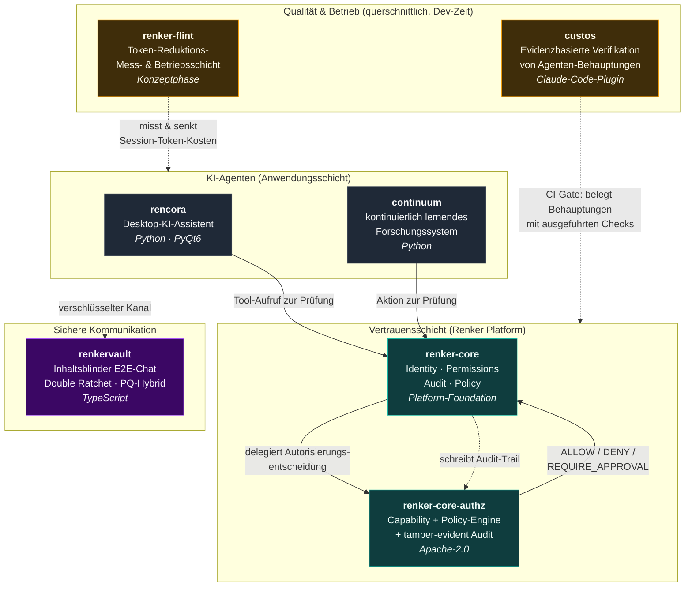

<h1 align="center">Renker — Trusted Infrastructure for Autonomous AI</h1>

  <em>Deterministische Autorisierung, nachvollziehbare Audit-Trails und inhaltsblinde E2E-Kommunikation für eine Welt, in der KI-Agenten eigenständig handeln.</em>

  <a href="https://sebastianrenker.github.io">🌐 Landingpage</a>

  
  
  
  

---

## Worum es geht

Autonome KI-Agenten treffen Entscheidungen und lösen Aktionen aus, bevor ein Mensch
mitliest. **Renker** ist ein Forschungs- und Prototyp-Ökosystem, das die fehlende
Vertrauensschicht dafür baut: Jede Agenten-Aktion läuft durch eine deterministische
Policy-Engine (`ALLOW` / `DENY` / `REQUIRE_APPROVAL`), landet in einem manipulations­erkennenden
(tamper-evident, nicht tamper-proof) Audit-Log und kommuniziert – wo nötig – über einen
Ende-zu-Ende-verschlüsselten Kanal mit Post-Quantum-Hybrid-Handshake (X25519 + ML-KEM-768).

Das adressiert konkrete Angriffsflächen agentischer Systeme – allen voran **Prompt-Injection**,
bei der ein Agent aus manipuliertem Kontext heraus Aktionen ausführt, die der Nutzer nie
autorisiert hat.

> ⚠️ **Status:** Forschungs-Prototypen (Phase 0). Nicht für den Produktivbetrieb gedacht.

---

## Wie die Bausteine zusammenhängen

**Kurz gesagt:** Agenten (`rencora`, `continuum`) fragen vor jeder sicherheitsrelevanten
Aktion die Vertrauensschicht. `renker-core` bündelt Identität, Rechte, Audit und Policy als
Plattform-Foundation und delegiert die eigentliche Autorisierungsentscheidung an
`renker-core-authz` – die deterministische, quelloffene Policy-Engine. `renkervault` liefert
den verschlüsselten Kanal, wenn Agenten oder Nutzer vertraulich kommunizieren müssen.
Querschnittlich, zur Entwicklungszeit (nicht zur Laufzeit integriert): `custos` erzwingt in
CI, dass Agenten-Behauptungen mit **ausgeführten** Checks belegt werden statt nur behauptet,
und `renker-flint` misst und senkt die Token-Kosten read-lastiger Sessions – beides nach
derselben Evidenz-Regel wie der Rest der Plattform (belegen statt behaupten).

---

## Repositories

| Repo | Rolle | Stack |
|------|-------|-------|
| [**renker-core-authz**](https://github.com/sebastianrenker/renker-core-authz) | Deterministische Capability- + Policy-Engine mit tamper-evident Audit für Agenten-Aktionen | Python · Apache-2.0 |
| [**renker-core**](https://github.com/sebastianrenker/renker-core) | Gemeinsame Plattform-Foundation: Identity, Permissions, Audit, Policy | Python |
| [**custos**](https://github.com/renker-industries/custos) | Evidenzbasierte Verifikation von Agenten-Behauptungen: erzwingt in CI **ausgeführte** Checks (Linter, Tests, Statik) statt bloßer Zusagen | Python · MIT |
| [**continuum**](https://github.com/sebastianrenker/continuum) | Prototyp eines kontinuierlich lernenden KI-Forschungssystems (Memory, Bayesian Optimization, Safety Gates, Anti-Hallucination) | Python |
| [**renkervault**](https://github.com/sebastianrenker/renkervault) | Inhaltsblinder E2E-verschlüsselter Chat-Prototyp (Double Ratchet, PQ-Hybrid-Handshake, Duress-Modus) | TypeScript |
| [**rencora**](https://github.com/sebastianrenker/rencora) | Persönlicher Desktop-KI-Assistent (Sprache, Screen/Kamera, Agenten, Gedächtnis) | Python · PyQt6 |
| [**renker-flint**](https://github.com/sebastianrenker/renker-flint) | Token-Reduktions-Mess- & Betriebsschicht für read-lastige Agent-Sessions; belegt Einsparungen provider-seitig statt sie zu behaupten (Konzeptphase) | Konfig · Messung · MIT |
| [**sebastianrenker.github.io**](https://github.com/sebastianrenker/sebastianrenker.github.io) | Plattform-Landingpage & Doku-Hub | HTML/CSS |

---

## Schwerpunkte

`agentic-ai` · `authorization` · `policy-engine` · `prompt-injection` · `tamper-evident-audit`
· `end-to-end-encryption` · `post-quantum-hybrid` · `metadata-minimization` · `agent-verification`
· `evidence-driven` · `token-efficiency`

---

🌐 <a href="https://sebastianrenker.github.io">sebastianrenker.github.io</a>

